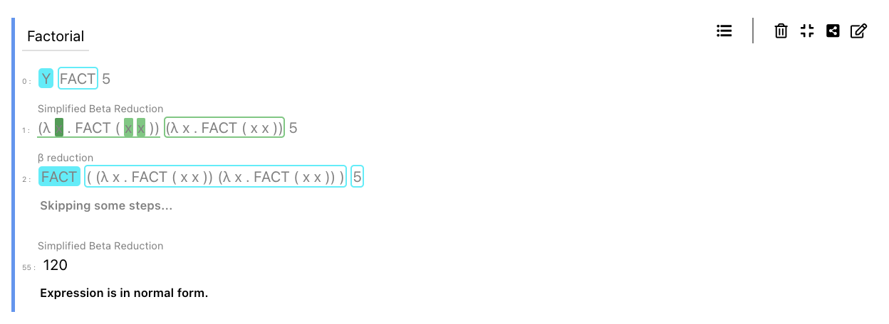

# :sunflower: :deciduous_tree: :tulip: :blossom: Welcome to my PL garden :rose: :seedling: :hibiscus: :herb:

I think type systems, type theory, formal logic, proof theory and formal reasoning are really interesting topics.
I build small programming languages, theorem provers, and other systems related to PLT concepts.

## I sometimes write about the things I learn [:pencil2: **in my digital notepad** :blue_book:](http://writing.lambdu.li)
The latest published post was a report on [Propositions as Types ⭐](http://writing.lambdu.li/reports/propositions-as-types)


## What I am growing now (in private) :seedling:


### Glask :blossom: :cactus:

Glask is my current, long-term project.
It is a small programming language inspired by Haskell.
It has type classes, higher-rank polymorphism, row polymorphism and other interesting features.

I have already [built a pretty large part of that as a part of my master's thesis](https://github.com/lambduli/original-glask).
At this point, I am reworking it from the ground up, formalizing the type system, and learning more things.
I am hoping to make the project public one day.


### [Detour](https://github.com/lambduli/detour) :four_leaf_clover: :tulip:

Detour is a small proof-checker for ~~a mix of _Second-order Propositional Logic_ and~~ _First-order Predicate Logic_ *Natural Deduction* proofs in *Fitch-style notation*.

It is a first step into the area of proof-checkers and (interactive) proof assistants.
I picked the Fitch-style notation because I find it nice to look at.
~~The goal is to have a very simple proof-checker that supports user-defined inductive data types/syntactic constructs, proof by induction, case analysis and maybe more.~~

[An example proof—a proof of totality of the addition on natural numbers.](https://gist.github.com/lambduli/d99a935f00845b910402d73976fa41a5)


## What I have grown :herb: :evergreen_tree:

### :school: [Lambdulus](https://github.com/lambdulus/frontend) :evergreen_tree:

Lambdulus is a tool for learning λ-calculus interactively.
It runs locally in any modern browser and enables you to experience λ-calculus as a programming language.

I have a strong appreciation for teaching tools.
This one is the first one I developed.
It's being used at FIT CTU in Prague for teaching λ-calculus in a course on programming paradigms.

<!--  -->


### [Resin](https://github.com/lambduli/resin) :hibiscus: :tulip:

Resin is a small automated theorem prover for _First Order Classical Logic_ built on *resolution*.

It's another step on my journey through the topic of formal reasoning and implementing theorem provers and proof assistants.
It is not my goal to make it real-world applicable at all. I just want to explore the concepts related to the _resolution_ and learn more about logic.


```
constants: zero .

aliases : 0 = zero
        , 1 = suc(0) .

axioms: ∀ n Plus(0, n, n)
      , ∀ n m r Plus(n, m, r) ==> Plus(suc(n), m, suc(r))

      , ∀ n Times(0, n, 0)
      , ∀ n m r a [Times(n, m, r) ∧ Plus(r, m, a) ==> Times(suc(n), m, a)]

      , Fact(0, 1)
      , ∀ n pr r [Fact(n, pr) ∧ Times(suc(n), pr, r) ==> Fact(suc(n), r)]
      .

theorem fact-0-is-1: Fact(0, 1) .

theorem fact-1-is-1 : Fact(1, 1) .

theorem exists-fact-for-1 : ∃ n Fact(n, 1) .
```


### [Plover](https://github.com/lambduli/plover) :rose:

Plover is a small automated theorem prover based on a logic language like *Prolog*.
The main idea is to replace *Minilog's* depth-first search strategy with a complete one.

It serves as the first step on my journey to study the topic of formal reasoning and automated and interactive theorem provers and assistants.
It's as small as _Minilog_.

The main difference the complete search strategy makes is that the language can productively answer queries like `nat(A).` for a knowledge base like the following:

```prolog
nat(s(N)) :- nat(N).
nat(z).
```


### [Minilog](https://github.com/lambduli/minilog) :cherry_blossom:

Minilog is an implementation of a small logic programming language.
The primary purpose of it is to present a simple abstract machine that can be easily implemented in any language and can serve as an aid when making the intuition about how such a language works.

I have designed the abstract machine and written a [description](https://github.com/lambduli/minilog/blob/main/WRITEUP.md) of it for (not only) my students to learn about how such a language works.
It is meant to inspire and offer a starting point to them should they decide to implement a small subset of Prolog as their course project.

_Minilog_ is not the first project in a line of logic languages.
In the past, I've implemented a small logic language [Monolog](https://github.com/lambduli/monolog).
But back then, I didn't know how to implement the _unification_ in a sensible way.
So, while the _Minilog_ implements unification according to _Martelli and Montanari_,
the first project keeps around sort of a _unification context_ making it very impractical and inefficient.


```prolog
plus(z, N, N).
plus(s(N), M, s(R)) :- plus(N, M, R).

times(z, _, z).
times(s(N), M, A) :- times(N, M, R), plus(R, M, A).

fact(z, s(z)).
fact(s(N), R) :- fact(N, PR), times(s(N), PR, R).
```


### [Frea](https://github.com/lambduli/frea) :chestnut:

Small programming language with HM type inference, higher-kinded types, and lazy evaluation.
Implemented as an AST interpreter in Haskell.

It's one of my first _larger_ projects. I wanted to learn about Hindley-Milner type inference and how to implement parametric polymorphism both for functions and data types. Additionally, I learned a bit about laziness.

Originally, the language used to treat recursion on terms very explicitly. There was a `fix` language construct.
Eventually, I replaced the `fix` with an implicit recursion. The type-checker first splits the definitions into groups of mutually recursive definitions and finds a topological ordering on them. This makes it possible to infer the types as polymorphic as possible.

  
```haskell
module Main where

{ data Result a
    = None
    | Some a

; let
  { zero n = (n == 0)
  ; dec n = (n - 1)
  ; rec fact n =  if (zero n)
                  then 1
                  else (n * (fact (dec n)))
  } in (Some (fact 5))
}
```


### [Lambda-pie](https://github.com/lambduli/lambda-pie) :palm_tree:

Three better simple REPLs for `λ->`, `λ2`, and `λΠ`.


```
λ-> >> assume (id :: T -> T) (T :: *) (a :: T) (b :: T)
λ-> >> id a
      (id a) :: T
λ-> >> id b
      (id b) :: T
```


### [Lambdas](https://github.com/lambduli/lambdas) :ear_of_rice:

Three simple REPLs for `λ`, `λ->`, and `λ2`.


### Older and Smaller Projects :fallen_leaf:

A couple of small lambda evaluators as a reference for my students:

- [A Small λ-evaluator Written in Racket](https://gist.github.com/lambduli/b07c8ce55aa182e3c809f7814eb4feeb) :mushroom:
- [A Small λ-evaluator Written in Elm](https://gist.github.com/lambduli/aa3a1a5ac2716e13cf4351006f0ab559) :mushroom:


All of the following, except the last one, were done as a semestral project or coursework during my master's.
The last one was a little thing I did while talking about JavaScript on a voice call with a friend.

#### [Monolog](https://github.com/lambduli/monolog) :maple_leaf:

Small logic programming language inspired by Prolog.
Implemented as an AST interpreter in Ruby.

```prolog
plus(z, N, N).
plus(s(N), M, s(R)) :- plus(N, M, R).

times(z, _, z).
times(s(N), M, A) :- times(N, M, R), plus(R, M, A).

fact(z, s(z)).
fact(s(N), R) :- fact(N, PR), times(s(N), PR, R).

:check

fact(s(s(s(s(s(z))))), F)
```

#### [SJS](https://github.com/lambduli/sjs) :maple_leaf:

A simple toy compiler from a Lisp-inspired programming language targetting JS.
Implemented as a parser and a trivial code-gen in Scala.

```lisp
(define fact (n)
  (if (or (= n 0) (= n 1))
    1
    (* n (fact (- n 1)))
  )
)

(fact 5)
```


#### [FeenyML](https://github.com/lambduli/FeenyML) :maple_leaf:

Interpreter and (incomplete) VM for a small programming language inspired by Feeny and ML.

```ml
function fact (num) ->
  if num == 0
  then 1
  else num * fact(num - 1);

fact(5)
```


#### [Call-by-Name ISWIM](https://gist.github.com/lambduli/662c6d934d3e8cd8670670d4468ee906) :mushroom:

Call-by-name operational semantics of ISWIM in PLT REDEX.

```
(((λ unused (λ x (* (+ 1 x) (+ 2 x))))
  ((λ x (x x)) (λ x (x x))))
 (+ 3 4))

:-->>n 72
```


#### [Transaction ISWIM](https://gist.github.com/lambduli/1e5f7714fef5269fbd214c587ff29588) :mushroom:

ISWIM with transactional memory in PLT REDEX.

```
(let ([a 80])
  (let ([b 20])
    (let ([adjust ;; Invariant: a + b = 100
           (λ f1
             (λ f2
               (transaction
                 (begin (set a (f1 a))
                        (set b (f2 b))
                        (if0 (+ (+ a b) -100) (λ x x) 1)))))])
      (begin ((adjust (λ a (* a 2))) (λ b (+ b -50))) ;; abort
             ((adjust (λ a (+ a -20))) (λ b (* b 2))) ;; commit
             a))))

evaluates to 60
```


#### [$wau ISWIM](https://gist.github.com/lambduli/7ab05d917518b666aa93e9cfee374eb1) :mushroom:

A little experiment with non-strict semantics of ISWIM in PLT REDEX.


#### [DFSM-DSL](https://gist.github.com/lambduli/68b9e1543fa557cbf75282e8a1adf0bc) :mushroom:

JS DSL for implementing Deterministic Finite State Machines using string template literal.

```javascript
  const dfsm = require('./dsl').dfsm
  
  
  let factorial = null
  factorial = dfsm`
    state default INIT
    
    call
      INIT -> ${(state, num) => num === 0 ? '1' : `${num}`}
        ${(state, num) => num === 0 ? undefined : factorial.call(num - 1)} .
    
    call
      ${state => state === 'INIT' ? 'NO' : state} -> ${(state, num) => num === 0 ? state : `${Number(state) * num}`}
        ${(state, num) => num === 0 ? state : factorial.call(num - 1)} .
  `
  
  factorial.call(5)
  console.log(factorial.state) // 120
```
