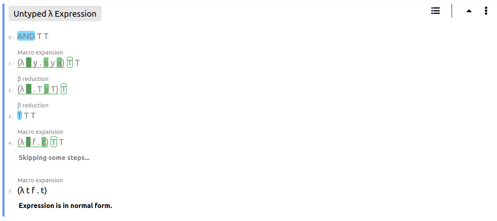

### Hi there 👋

I'am John and I'm interested in the PL and Type Systems related stuff.

## Some of my favourite work:

<br></br>

## Lambdulus

### Lambdulus Web Environment

[repo](https://github.com/lambdulus/frontend)

Lambdulus is a tool for learning λ-calculus interactively. It runs online on any modern browser and enables you to to experience λ-calculus as a programming language.

<!--
TODO: insert screenshot of Lambdulus (factorial)
-->

<br></br>

### Core module of the Lambdulus

[repo](https://github.com/lambdulus/core) 

<!--
TODO: remove this screenshot
-->



<br/><br/>

## Frea

### Simple programming language with Damas-Hindley-Milner type inference

[repo](https://github.com/Taskkill/frea)

```haskell
  let
    zero = (\ n -> (#= (n, 0)))
  in let rec
    fact n =  if (zero n)
              then 1
              else (#* (n, (fact (#- (n, 1)))))
  in (fact 5)
```

<br/><br/>

## Monolog

### REPL for small and simple logic programming language inspired by Prolog

[repo](https://github.com/Taskkill/monolog)

```prolog
  plus(z, N, N).
  plus(s(N), M, s(R)) :- plus(N, M, R).
  
  times(z, _, z).
  times(s(N), M, A) :- times(N, M, R), plus(R, M, A).
  
  fact(z, s(z)).
  fact(s(N), R) :- fact(N, PR), times(s(N), PR, R).
```

<br/><br/>

## SJS

### Very simple compiler from Lisp-inspired programming language compiled to JS

[repo](https://github.com/Taskkill/sjs)

```lisp
  (define fact (n)
    (if (or (= n 0) (= n 1))
      1
      (* n (fact (- n 1)))
    )
  )
```

<br/><br/>

## FeenyML

### Interpreter and (incomplete) VM for small programming language inspired by Feeny and ML

[repo](https://github.com/Taskkill/FeenyML)

```ml
  function fact (num) ->
    if num == 0
    then 1
    else num * fact(num - 1);

  fact(10)
```

<br/><br/>


## Lambdas

### Three simple REPLs of various lambda calculi

[repo](https://github.com/Taskkill/lambdas)

```
  [enter λ2 expression]
  :$ (\ a : forall A . A -> A -> A . a) (/ B . (\t : B . (\f : B . t)))
  [command or expression]:$ :type
  :: (forall A . A -> A -> A)
```

<br/><br/>

## DFSM-DSL

### JS DSL for implementating Deterministic Finite State Machines


[repo](https://github.com/Taskkill/dfsm-dsl)

<!--
TODO: change example to compute factorial too
-->

```javascript
  dfsm`
    state default CON${true ? 'NECT' : 'TROLL'}ED
    state OPENED
    state PROCESSED
    state RESETTED

    open CONNECTED -> OPENED .

    add
      OPENED -> OPENED
        ${ (s, newItem) => items.push(newItem) } .

    process
      OPENED -> PROCESSED
        ${ () => items } .

    reset
      PROCESSED -> ${(s, input) => input === 'hard' ? 'RESETTED' : 'OPENED'}
        ${(s, input) => items = input === 'hard' ? [] : items} .
  `
```